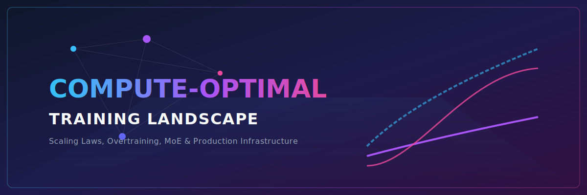
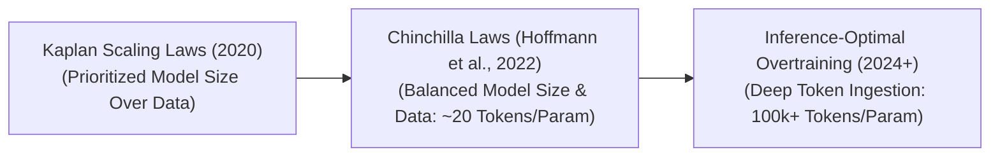

# 🚀 Awesome Compute-Optimal Training 📊

  

   

## 🔍 Compute-Optimal Training: Evolution, Variants, Types, & Applications

**Compute-Optimal Training** is a cornerstone framework in Large Language Model (LLM) pre-training that determines the exact mathematical balance between a model's parameter scale ($N$) and the total volume of training data ($D$, measured in tokens) to achieve the maximum possible performance (lowest cross-entropy loss) for a fixed compute budget ($C$). Prioritising compute efficiency prevents developers from wasting millions of dollars in GPU capital on architectures that are either "capacity-starved" (too large for their data) or "over-trained" relative to optimal efficiency thresholds. 

---

## 📅 1. The Chronological Evolution

The technical approach to scaling artificial intelligence has transitioned from parameter-skewed estimations to tightly bounded tokens-per-parameter allocations and downstream-focused inference-optimized overtraining profiles.

| Era / Concept | Details | Year | First Paper |
| :--- | :--- | :--- | :--- |
| [**The Parameter-Dominant Era (Kaplan / OpenAI Scaling Laws, 2020)**](details/parameter_dominant_era.md) | **Concept:** The foundational scaling analysis. The early OpenAI research team concluded that when compute budgets scale up, developers should allocate the majority of resources to expanding model parameter size ($N$), while scaling dataset size ($D$) at a significantly slower rate.  **Limitation:** Led to heavily under-trained architectures (e.g., GPT-3 was an un-converged 175B model trained on only 300 billion tokens), rendering them computationally inefficient to host. | 2020 | [Scaling Laws for Neural Language Models](https://arxiv.org/abs/2001.08361) |
| [**The Equal Scaling Revolution (Chinchilla Laws, Hoffmann et al. / DeepMind, 2022)**](details/equal_scaling_revolution.md) | **Concept:** Overturned Kaplan’s findings by explicitly accounting for learning rate decay hyperparameters. DeepMind proved that $N$ and $D$ should actually be scaled in equal proportions. For maximum compute-optimal efficiency, a model requires approximately **20 tokens per individual parameter** (e.g., a 70B model requires 1.4 trillion tokens to hit the compute-optimal frontier).  **Significance:** Fully restructured base-model training across the AI ecosystem, delivering significantly smaller, faster, and more capable models (like Chinchilla 70B outperforming Gopher 280B). | 2022 | [Training Compute-Optimal Large Language Models](https://arxiv.org/abs/2203.15556) |
| [**The Inference-Optimal Overtraining Era (~2024–Present)**](details/inference_optimal_overtraining.md) | **Concept:** Shifted focus from *training efficiency* to *lifetime inference serving cost*. If a model is going to be queried billions of times in production, it makes commercial sense to purposefully "overtrain" a small model far past its theoretical training compute-optimal boundary.  **Significance:** Modern enterprise architectures ingest immense token counts (e.g., Llama 3 8B trained on over 15 trillion tokens, achieving an ultra-dense ratio exceeding **1,800 tokens per parameter**), keeping generation latency and VRAM footprints compact. | 2023 | [LLaMA: Open and Efficient Foundation Language Models](https://arxiv.org/abs/2302.13971) |

---

## ⚙️ 2. Core Scaling Law Variants

Compute-optimal frameworks are mathematically structured around distinct empirical scaling approaches to isolate power-law exponents.

| Variant | Mechanism & Behavior | Year | First Paper |
| :--- | :--- | :--- | :--- |
| [**The Parametric Loss Model (Power-Law Estimation)**](details/parametric_loss_model.md) | **Mechanism:** Models the final cross-entropy evaluation loss ($L$) as a multi-variable power-law function: $$L(N, D) = \frac{A}{N^\alpha} + \frac{B}{D^\beta} + E$$ **Behavior:** By training dozens of tiny models (e.g., 10M to 1B parameters) on variable token durations, engineers fit the constant exponents ($\alpha, \beta, A, B$), forecasting the precise behavior of a 100B+ parameter system before launching the run. | 2020 | [Scaling Laws for Neural Language Models](https://arxiv.org/abs/2001.08361) |
| [**Empirical Frontier Estimations**](details/empirical_frontier_estimations.md) | **Mechanism:** Traces an explicit geometric envelope across a grid of completed training run data coordinates. It maps the lowest achievable loss points for every given computational FLOP expenditure level. | 2020 | [Scaling Laws for Neural Language Models](https://arxiv.org/abs/2001.08361) |
| [**Downstream Capabilities Alignment Scaling**](details/downstream_capabilities_alignment.md) | **Mechanism:** Moves past broad cross-entropy loss tracking to evaluate compute optimality against explicit downstream capabilities (such as coding accuracy, mathematical reasoning limits, or multi-hop retrieval benchmarks). | 2024 | [Scaling Laws for Downstream Task Performance of Large Language Models](https://arxiv.org/abs/2402.04177) |

---

## 🛠️ 3. Training Modifications & Structural Types

Depending on whether an AI system integrates safety alignments or structural sparse routing, compute-optimal training configurations require unique modifications.

| Type / Modification | The Shift & Significance | Year | First Paper |
| :--- | :--- | :--- | :--- |
| [**Aligned Compute Optimization (The Safety Tax Frontier)**](details/aligned_compute_optimization.md) | **The Shift:** Incorporating alignment pipelines (SFT, RLHF, DPO) introduces an explicit behavioral penalty. Because safety guardrails restrict response distributions, the classic compute-optimal curve shifts, requiring models to scale parameter counts ($N$) wider and deeper earlier in their lifecycle to absorb safety behaviors without corrupting core logic capabilities. | 2022 | [Training a Helpful and Harmless Assistant with Reinforcement Learning from Human Feedback](https://arxiv.org/abs/2204.05862) |
| [**Mixture-of-Experts (MoE) Scaling Optimization**](details/mixture_of_experts_scaling.md) | **The Shift:** Decouples a model's active compute footprint from its total parameter capacity. By organizing weights into sparse, gated expert blocks (e.g., DeepSeek-V3), a model can hold hundreds of billions of total parameters on disk, while activating only a tiny fraction per token.  **Significance:** Completely breaks traditional Chinchilla scaling restrictions, allowing massive capacity expansions with drastically lower training FLOP expenditures. | 2022 | [Unified Scaling Laws for Routed Language Models](https://arxiv.org/abs/2202.01629) |

---

## ⚡ 4. Production Engineering Challenges & Mitigations

Executing massive compute-optimal training runs across large-scale distributed hardware clusters introduces severe hyperparameter risks and data scarcity walls.

| Challenge | Problem & Mitigation | Year | First Paper |
| :--- | :--- | :--- | :--- |
| [**The High-Precision Learning Rate Decay Lock**](details/lr_decay_lock.md) | **The Problem:** Standard power-law projections depend on the assumption that the learning rate (LR) decay schedule matches the exact target token destination. If an enterprise training run is scheduled for 5 trillion tokens, but the engineering team decides to abort or extend the run midway, the LR scheduler will be completely unaligned, degrading the model's compute efficiency.  **Mitigation:** Implementing **Continuous/Infinite LR Schedulers** (such as constant learning rates with terminal decay steps or inverse-square-root decay scripts) to permit flexible training horizons without sacrificing optimal loss convergence. | 2024 | [Scaling Laws and Compute-Optimal Training Beyond Fixed Training Durations](https://arxiv.org/abs/2405.18392) |
| [**The Data Wall Constraint (Token Exhaustion)**](details/data_wall_constraint.md) | **The Problem:** As compute budgets climb into the YottaFLOP scale, compute-optimal equations demand tens or hundreds of trillions of unique, high-quality text tokens—rapidly exhausting the entire available pool of human-written internet text.  **Mitigation:** Deploying **Synthetic Data Generation Pipelines** (using frontier models to synthesize pristine, error-free reasoning traces, programming scenarios, and textbook scripts) alongside **Multi-Modal Data Ingestion** (tokenizing video, acoustics, and software AST structures) to multiply the available data matrix. | 2022 | [Will we run out of data? Limits of LLM scaling on human-written data](https://arxiv.org/abs/2211.04325) |

---

## 🏢 5. Frontier Real-World AI Infrastructure Applications

| Application | Description | Year | First Paper |
| :--- | :--- | :--- | :--- |
| [**Pre-Training Frontier Foundation LLM Suites (Llama / DeepSeek)**](details/pretraining_frontier_suites.md) | **Application:** Guides cluster-wide hardware allocation policies. Deep learning infrastructure teams run tiny, high-precision pilot runs to calibrate scaling equations exactly, ensuring that multi-million dollar training budgets spent over thousands of GPUs yield the absolute sharpest possible model intelligence. | 2023 | [LLaMA: Open and Efficient Foundation Language Models](https://arxiv.org/abs/2302.13971) |
| [**High-Throughput inference-Optimized Serving (vLLM Deployments)**](details/high_throughput_serving.md) | **Application:** Maximizes enterprise server concurrency. By leveraging the principles of inference-optimal overtraining, companies serve heavily over-trained 1.5B and 8B parameters models that match the reasoning capacity of older 70B networks, dropping VRAM overhead and cutting request processing latencies. | 2023 | [Efficient Memory Management for Large Language Model Serving with PagedAttention](https://arxiv.org/abs/2309.06180) |
| [**Sparsely Routed Mixture-of-Experts Scaling (DeepSeek-V3 / Mixtral)**](details/sparsely_routed_moe.md) | **Application:** Orchestrates distributed training pipelines. Compute-optimal tracking models for sparse architectures map exact token-to-expert routing ratios, ensuring data-parallel and expert-parallel hardware shards balance compute processing loops without encountering server stalls. | 2024 | [Mixtral of Experts](https://arxiv.org/abs/2401.04088) |
