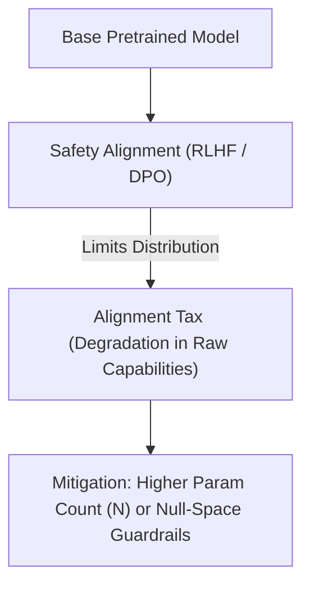

# Aligned Compute Optimization (The Safety Tax Frontier)

## Overview
Incorporating alignment pipelines—such as Reinforcement Learning from Human Feedback (RLHF), Direct Preference Optimization (DPO), and Supervised Fine-Tuning (SFT)—introduces a safety/alignment tax. This tax represents the performance degradation in a model's core reasoning or capabilities as it is constrained to align with safety guidelines.

## Concept
Because safety alignment restricts the output token distribution, the compute-optimal scaling frontier shifts. Models need to allocate more compute (parameter scale or training tokens) to safety-aligned phases to maintain the same level of downstream task execution quality.

## Diagram

## References
- [Training a Helpful and Harmless Assistant with Reinforcement Learning from Human Feedback](https://arxiv.org/abs/2204.05862)

[Back to README](../README.md)
