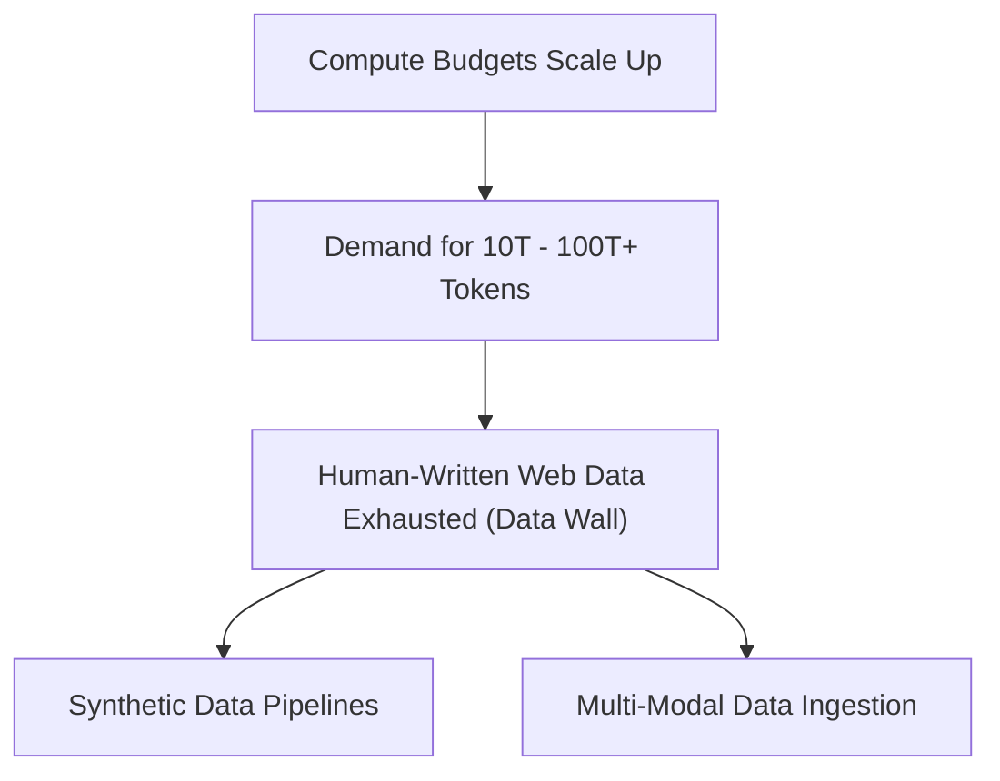

# The Data Wall Constraint (Token Exhaustion)

## Overview
As compute budgets expand, compute-optimal equations demand tens or hundreds of trillions of unique, high-quality tokens. However, the total pool of high-quality human-written text on the internet is projected to be fully exhausted.

## Mitigations
- **Synthetic Data Generation:** Using frontier models to generate reasoning traces, code, and math problems.
- **Multi-Modal Data:** Tokenizing images, videos, audio, and software AST structures to expand the available corpus.

## Diagram

## References
- [Will we run out of data? Limits of LLM scaling on human-written data](https://arxiv.org/abs/2211.04325)

[Back to README](../README.md)
