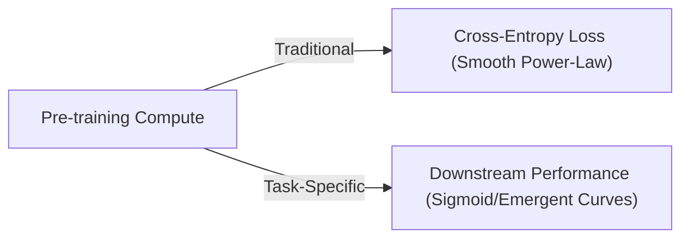

# Downstream Capabilities Alignment Scaling

## Overview
Traditional scaling laws focus on pre-training cross-entropy loss. However, lower pre-training loss does not always translate linearly to downstream capabilities (e.g., coding, reasoning, agentic tool-use). Downstream Capabilities Alignment Scaling maps scaling dynamics specifically against target downstream task performance.

## Key Insights
- Task performance often exhibits emergent phase transitions (sigmoid-like curves) rather than smooth power-laws.
- Alignment of pre-training data distributions with downstream tasks significantly influences the scaling curve.

## Diagram

## References
- [Scaling Laws for Downstream Task Performance of Large Language Models](https://arxiv.org/abs/2402.04177)

[Back to README](../README.md)
