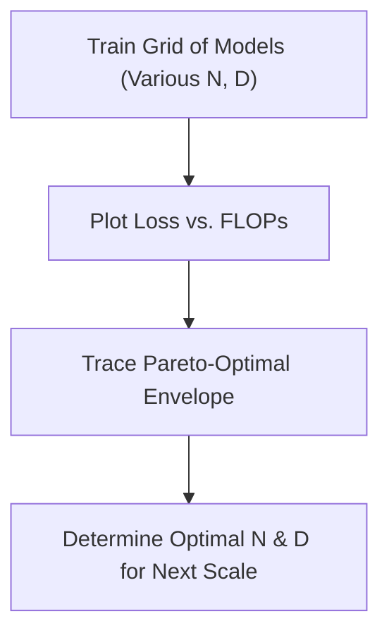

# Empirical Frontier Estimations

## Overview
Empirical Frontier Estimation involves mapping the lower envelope of cross-entropy loss over a large grid of actual training runs with varying parameter sizes ($N$) and token budgets ($D$). Instead of relying strictly on parametric models, this method maps the actual realized performance boundary.

## Methodology
1. Train a diverse matrix of models with varying $N$ and $D$.
2. Plot the loss against total training FLOPs.
3. Identify the Pareto-optimal frontier (the lowest loss achieved for each compute budget).

## Diagram

## References
- [Training Compute-Optimal Large Language Models](https://arxiv.org/abs/2203.15556)

[Back to README](../README.md)
