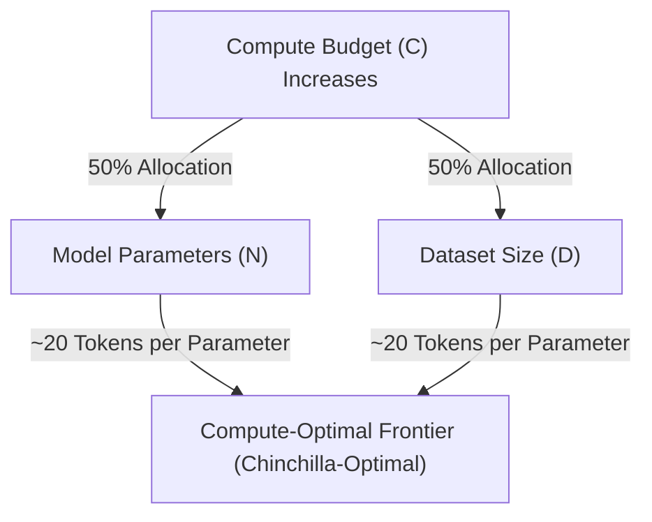

# The Equal Scaling Revolution (Chinchilla Laws, 2022)

## Overview
In 2022, Hoffmann et al. (DeepMind) published "Training Compute-Optimal Large Language Models". They corrected OpenAI's earlier Kaplan scaling laws by showing that learning rate decay schedules must be tuned appropriately for each budget. They concluded that parameters ($N$) and dataset size ($D$) should be scaled in equal proportions.

## Key Formula
For a given compute budget $C \approx 6ND$:
- $N \propto C^a$
- $D \propto C^b$
where $a \approx 0.5$ and $b \approx 0.5$.
This implies a constant ratio of approximately **20 tokens per parameter** for compute-optimal training.

## Significance
Chinchilla (70B parameters) was trained on 1.4T tokens (20:1 ratio) and outperformed Gopher (280B parameters, trained on 300B tokens) while using the same training compute. It demonstrated that smaller, well-trained models are both training-efficient and much cheaper to serve.

## Diagram

## References
- [Training Compute-Optimal Large Language Models](https://arxiv.org/abs/2203.15556)

[Back to README](../README.md)
