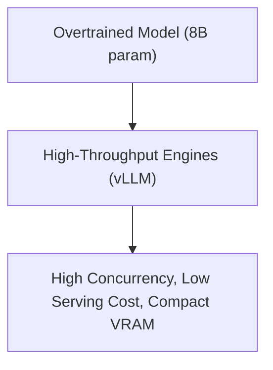

# High-Throughput inference-Optimized Serving (vLLM Deployments)

## Overview
Deploying LLMs at enterprise scale requires minimizing VRAM footprints and maximizing request throughput. Overtraining smaller models (e.g., Llama 3 8B) achieves capabilities comparable to larger, under-trained models (e.g., Gopher 280B) but with significantly faster serving speed.

## Core Benefits
- Lower VRAM requirements allow hosting on fewer/cheaper GPUs.
- Fits larger context windows in the KV cache.
- Higher throughput serving libraries (such as vLLM) can run optimized kernels.

## Diagram

## References
- [Efficient Memory Management for Large Language Model Serving with PagedAttention](https://arxiv.org/abs/2309.06180)

[Back to README](../README.md)
