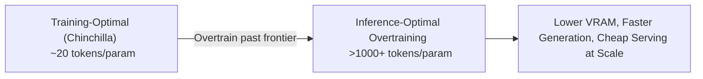

# The Inference-Optimal Overtraining Era (~2024–Present)

## Overview
While Chinchilla laws optimize for *training* compute efficiency, real-world deployment requires optimizing for *inference* serving costs. If a model is queried billions of times, it is highly economical to "overtrain" a smaller model (far past the Chinchilla-optimal 20 tokens/parameter limit) to make it smarter yet cheaper to serve.

## Key Concept
By training a smaller model on significantly more tokens (e.g., Llama 3 8B trained on 15T tokens, leading to an overtraining ratio of ~1,800 tokens per parameter), the downstream generation speed increases and memory requirements drop, drastically decreasing the serving cost per token.

## Diagram

## References
- [LLaMA: Open and Efficient Foundation Language Models](https://arxiv.org/abs/2302.13971)

[Back to README](../README.md)
