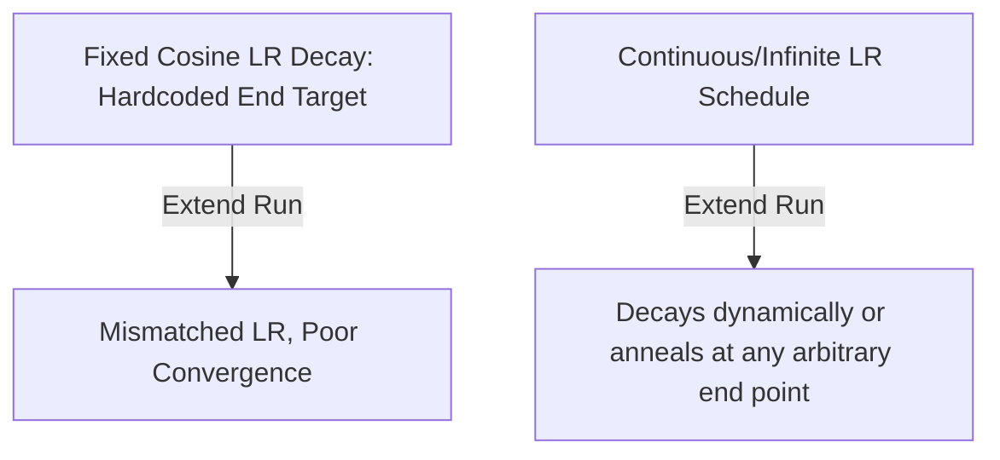

# The High-Precision Learning Rate Decay Lock

## Overview
Traditional scaling studies assume the learning rate (LR) decay schedule matches the total training duration (e.g., cosine decay to zero at the final token). If training is aborted early or extended mid-run, the LR schedule is ruined, degrading compute efficiency.

## Mitigation
Continuous or Infinite LR Schedulers (such as Warmup-Stable-Decay or constant LR with rapid annealing phases) decouple the training progress from a fixed horizon, allowing flexible stop-and-resume pre-training.

## Diagram

## References
- [Scaling Laws and Compute-Optimal Training Beyond Fixed Training Durations](https://arxiv.org/abs/2405.18392)

[Back to README](../README.md)
