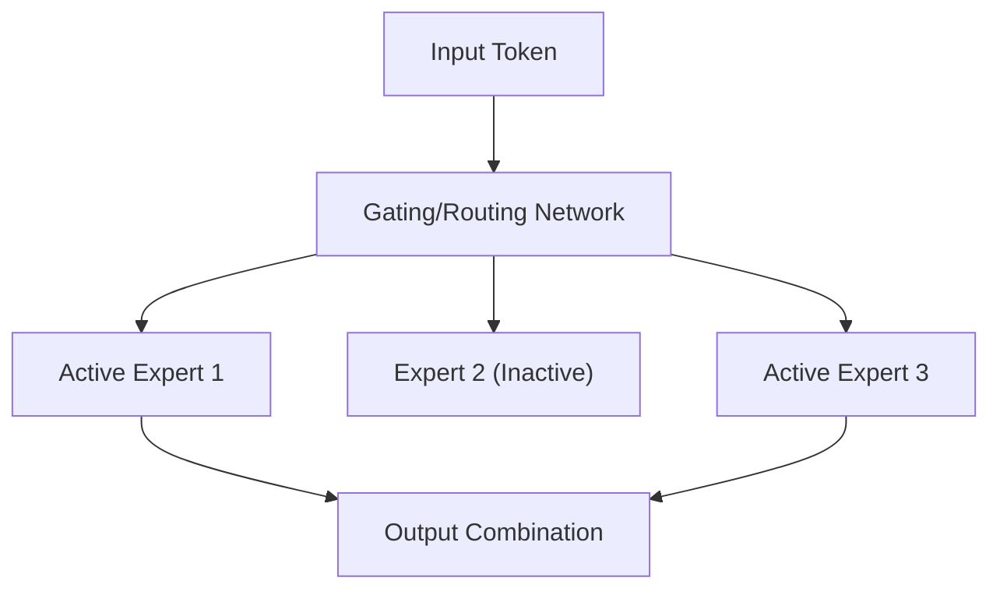

# Mixture-of-Experts (MoE) Scaling Optimization

## Overview
Mixture-of-Experts (MoE) decouples a model's active compute footprint from its total parameter capacity. By organizing the network into sparse, gated expert blocks, the model can have massive overall capacity (e.g., hundreds of billions of parameters) while activating only a fraction of those parameters per token.

## Significance
MoE architectures break traditional dense scaling laws. They allow models to enjoy the capacity and performance benefits of extremely large model sizes while operating with the training and inference compute costs of much smaller models.

## Diagram

## References
- [Unified Scaling Laws for Routed Language Models](https://arxiv.org/abs/2202.01629)

[Back to README](../README.md)
