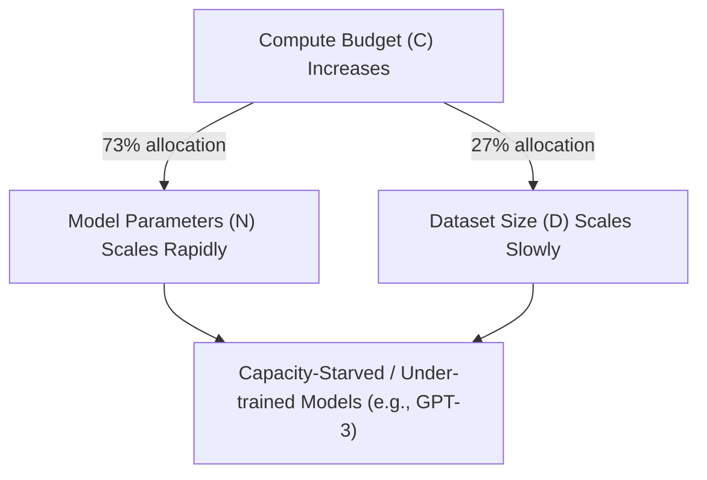

# The Parameter-Dominant Era (Kaplan / OpenAI Scaling Laws, 2020)

## Overview
In 2020, Kaplan et al. from OpenAI published their seminal paper on neural scaling laws. They observed that cross-entropy loss follows a power-law relationship with model parameters ($N$), dataset size ($D$), and compute ($C$). Their primary conclusion was that model capacity ($N$) should be scaled much faster than the dataset size ($D$) as the compute budget increases.

## Key Formula
The relationship was modeled as:
$$L(N) \approx \left(\frac{N_c}{N}\right)^{\alpha_N}$$
where $\alpha_N \approx 0.076$. They proposed that for a $10\times$ increase in compute, model size should scale by $7.3\times$, while dataset size should only scale by $1.3\times$.

## Limitation
This led to models that were extremely large but trained on relatively few tokens (e.g., GPT-3 with 175B parameters trained on only 300B tokens). Such models are "under-trained" and inefficient for inference because they require massive GPU memory to host relative to their actual capability.

## Diagram

## References
- [Scaling Laws for Neural Language Models](https://arxiv.org/abs/2001.08361)

[Back to README](../README.md)
