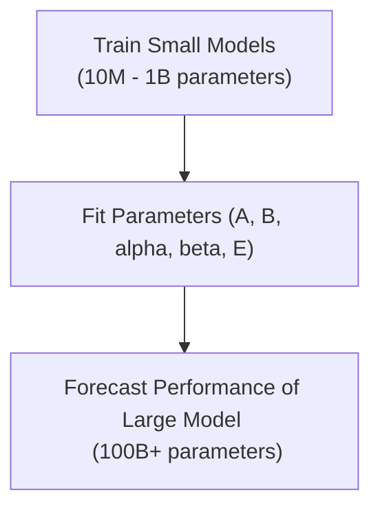

# The Parametric Loss Model (Power-Law Estimation)

## Overview
The Parametric Loss Model is a mathematical framework used to predict the final performance (cross-entropy loss) of a large language model before running the actual large-scale training run. It fits a parametric power-law function using data from small-scale training runs.

## Mathematical Formulation
The loss is modeled as:
$$L(N, D) = \frac{A}{N^\alpha} + \frac{B}{D^\beta} + E$$
Where:
- $N$ is the number of model parameters.
- $D$ is the number of training tokens.
- $A, B, \alpha, \beta, E$ are constants fitted empirically.

## Diagram

## References
- [Scaling Laws for Neural Language Models](https://arxiv.org/abs/2001.08361)

[Back to README](../README.md)
