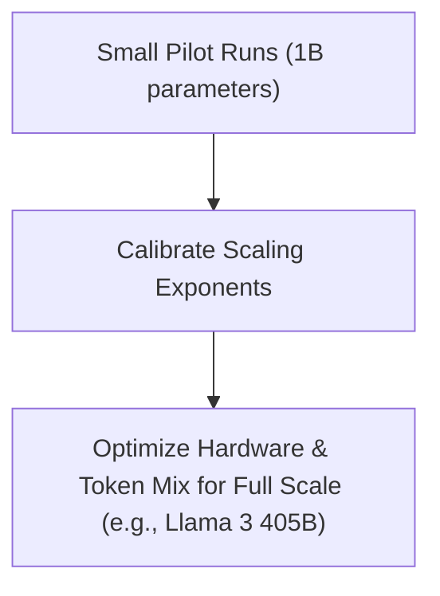

# Pre-Training Frontier Foundation LLM Suites (Llama / DeepSeek)

## Overview
Infrastructure teams training massive frontier suites (e.g., Meta's Llama or DeepSeek's models) use compute-optimal training scaling equations to allocate multi-million dollar budgets efficiently. They run small-scale pilot models to calibrate scaling parameters.

## Application
- Calibrating power-law equations on 10M to 1B models.
- Determining the optimal data mixture (code vs. math vs. natural language) as scaling changes.
- Planning the hardware layout and scheduling network bandwidth for optimal training.

## Diagram

## References
- [LLaMA: Open and Efficient Foundation Language Models](https://arxiv.org/abs/2302.13971)

[Back to README](../README.md)
