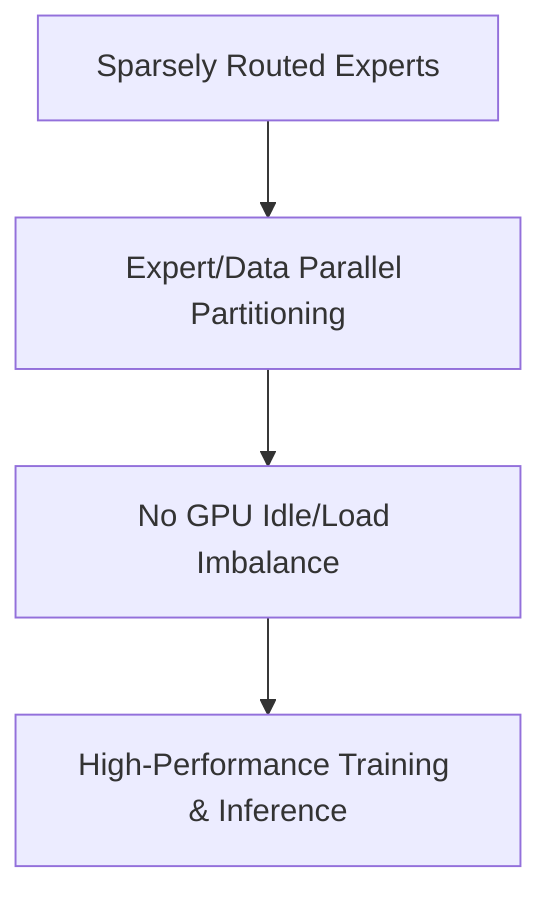

# Sparsely Routed Mixture-of-Experts Scaling (DeepSeek-V3 / Mixtral)

## Overview
State-of-the-art architectures like DeepSeek-V3 and Mixtral 8x7B implement Sparsely Routed MoE, mapping exact routing configurations to balance GPU memory bandwidth and computation. Scaling laws for MoE architectures help predict how to balance expert capacity and active parameters.

## Application
- Optimizes distributed pipeline parallelization.
- Maps token-to-expert ratios to avoid server load imbalances and stalls during cluster pre-training.

## Diagram

## References
- [Mixtral of Experts](https://arxiv.org/abs/2401.04088)

[Back to README](../README.md)
